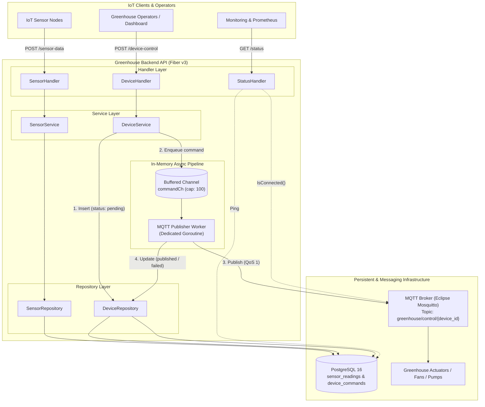

# Greenhouse IoT Backend - System Architecture & Design Document

This document outlines the architectural principles, concurrency patterns, storage strategies, fault-tolerance mechanisms, and technical trade-offs implemented in the **Greenhouse IoT Backend Service**.

---

## 1. System Overview & Objectives

Modern precision agriculture and greenhouse management require high-throughput ingestion of environmental sensor data (temperature, humidity, CO₂, soil moisture) combined with responsive, reliable actuator control (irrigation valves, exhaust fans, supplemental grow lights).

### Key Architectural Goals:
1. **Low Ingestion Latency**: Accept and validate telemetry data quickly without bottlenecking sensor devices.
2. **Decoupled Actuator Dispatch**: Decouple client HTTP request cycles from external MQTT network round-trips.
3. **Observability & Health Transparency**: Expose real-time dependency status (PostgreSQL, MQTT Broker).
4. **Data Integrity & Traceability**: Guarantee that all issued commands are persisted and trackable throughout their lifecycle (`pending` ➔ `published` / `failed`).
5. **Clean Maintainability**: Enforce modularity using Go interface-driven layered architecture.

---

## 2. High-Level Architecture & Data Flow



---

## 3. Layered Clean Architecture

The codebase adheres strictly to Go clean architecture conventions with dependency injection via interfaces:

```
HTTP / Transport Layer (internal/handler)
            │
            ▼
Business Logic Layer (internal/service)
            │
            ▼
Data Access Layer (internal/repository)
            │
            ▼
Database / Driver Layer (internal/database, internal/mqtt)
```

### Component Responsibilities:

| Layer | Primary Packages | Responsibilities |
| :--- | :--- | :--- |
| **Transport** | `internal/handler`, `internal/middleware` | Parsing HTTP requests, payload validation using `validator/v10`, producing standardized JSON responses (`middleware.SendSuccess`, `middleware.SendError`). |
| **Domain DTO / Model** | `internal/dto`, `internal/model` | Data transfer structs with validation tags; core domain entities reflecting database schemas. |
| **Service** | `internal/service` | Business logic orchestration, setting default UTC timestamps, pushing commands into asynchronous channels. |
| **Repository** | `internal/repository` | Raw SQL query execution via `sqlx`, mapping relational rows to Go domain models, database error wrapping. |
| **Infrastructure** | `internal/database`, `internal/mqtt`, `internal/config` | Managing database connection pools, MQTT client lifecycle, background worker goroutines, environment configuration. |

---

## 4. Concurrency Model & Asynchronous Processing

### 4.1. Fast HTTP Ingestion vs Slow MQTT Round-trips

In an IoT system, HTTP clients (e.g. mobile apps, web dashboards, automated rules engines) expect sub-millisecond response times when issuing device commands. However:
- MQTT brokers may experience intermittent network latency or connection re-negotiations.
- Synchronous MQTT publishing (`WaitTimeout`) in the HTTP request path would tie up HTTP worker threads, exhaust connection pools, and degrade throughput.

### 4.2. Channel-Decoupled Publisher Pattern

To solve this, device control execution is decoupled using a Go buffered channel (`chan model.DeviceCommand`):

1. **Synchronous Phase (Fast):**
   - Handler validates JSON payload (`device_id`, `command: ON|OFF`).
   - Repository persists the command record in PostgreSQL with `status = 'pending'`.
   - Command is pushed to `commandCh` using a non-blocking `select`:
     ```go
     select {
     case s.commandCh <- *cmd:
         // Enqueued successfully
     default:
         return nil, fmt.Errorf("command channel queue is full; please retry later")
     }
     ```
   - HTTP response is returned immediately (`200 OK`) with the newly created command record and its UUID.

2. **Asynchronous Phase (Background Goroutine):**
   - The `mqtt.Worker` runs continuously in its own goroutine:
     ```go
     func (w *Worker) Start(ctx context.Context) {
         go func() {
             for {
                 select {
                 case <-ctx.Done():
                     return
                 case cmd, ok := <-w.commandCh:
                     if !ok { return }
                     w.processCommand(cmd)
                 }
             }
         }()
     }
     ```
   - Formats the MQTT JSON payload (`device_id`, `command`, `timestamp`).
   - Publishes to `greenhouse/control/{device_id}` with **QoS 1**.
   - Upon successful ACK or timeout/error, updates the database row to `published` (with `published_at` timestamp) or `failed`.

### 4.3. Panic Recovery & Worker Continuity

Worker goroutines include a deferred recovery handler to prevent unexpected panics from terminating the background loop:

```go
defer func() {
    if r := recover(); r != nil {
        slog.Error("Recovered from panic inside MQTT worker", "panic", r, "command_id", cmd.ID)
    }
}()
```

### 4.4. Graceful Shutdown Workflow

When the service receives a termination signal (`SIGINT` or `SIGTERM`):
1. `signal.Notify` intercepts the OS signal.
2. The root `context.CancelFunc` is triggered, signaling background workers to exit gracefully.
3. `app.ShutdownWithTimeout(5 * time.Second)` allows active in-flight HTTP requests to complete before terminating.
4. Database connections (`db.Close()`) and MQTT client sessions are closed cleanly.

---

## 5. Data Model & Database Strategy

### 5.1. Database Schema

#### `sensor_readings` Table
Stores raw time-series environmental measurements.

```sql
CREATE TABLE IF NOT EXISTS sensor_readings (
    id BIGSERIAL PRIMARY KEY,
    public_id UUID NOT NULL DEFAULT gen_random_uuid() UNIQUE,
    device_id VARCHAR(255) NOT NULL,
    sensor_type VARCHAR(50) NOT NULL,
    value DOUBLE PRECISION NOT NULL,
    unit VARCHAR(20),
    recorded_at TIMESTAMPTZ NOT NULL DEFAULT now(),
    created_at TIMESTAMPTZ NOT NULL DEFAULT now()
);

CREATE INDEX IF NOT EXISTS idx_sensor_readings_public_id ON sensor_readings(public_id);
CREATE INDEX IF NOT EXISTS idx_sensor_readings_device_id ON sensor_readings(device_id);
CREATE INDEX IF NOT EXISTS idx_sensor_readings_recorded_at ON sensor_readings(recorded_at DESC);
```

#### `device_commands` Table
Maintains an audit trail of actuation commands and execution states.

```sql
CREATE TABLE IF NOT EXISTS device_commands (
    id BIGSERIAL PRIMARY KEY,
    public_id UUID NOT NULL DEFAULT gen_random_uuid() UNIQUE,
    device_id VARCHAR(255) NOT NULL,
    command VARCHAR(10) NOT NULL,
    status VARCHAR(20) NOT NULL DEFAULT 'pending',
    published_at TIMESTAMPTZ,
    created_at TIMESTAMPTZ NOT NULL DEFAULT now()
);

CREATE INDEX IF NOT EXISTS idx_device_commands_public_id ON device_commands(public_id);
CREATE INDEX IF NOT EXISTS idx_device_commands_device_id ON device_commands(device_id);
CREATE INDEX IF NOT EXISTS idx_device_commands_status ON device_commands(status);
```

### 5.2. ID Strategy: Internal `BIGSERIAL` vs External `UUID`

- **Internal Key (`id BIGSERIAL`)**: Utilized internally for efficient B-Tree indexing, foreign key joins, and sequential clustering performance.
- **External Identifier (`public_id UUID`)**: Exposed via public APIs (`JSON`) to prevent sequential enumeration attacks and maintain privacy across external consumers.

### 5.3. Indexing Strategy & Query Optimization

- `idx_sensor_readings_device_id`: Fast filtering by specific sensor device.
- `idx_sensor_readings_recorded_at (DESC)`: Optimized for dashboard time-series queries (e.g. latest 50 readings).
- `idx_device_commands_status`: Fast lookup for audit monitors checking for stuck `pending` or `failed` commands.

---

## 6. MQTT Protocol & Messaging Architecture

### 6.1. Topic Hierarchy Design

```
greenhouse/
└── control/
    └── {device_id}      <-- e.g., greenhouse/control/fan-01, greenhouse/control/pump-02
```

- **Granular Scoping**: Devices subscribe only to their own subtopic (`greenhouse/control/fan-01`), minimizing unnecessary traffic on edge microcontroller units (MCUs).
- **Wildcard Auditing**: Monitoring tools and supervisors can subscribe to `greenhouse/control/#` to capture all actuation traffic across the entire greenhouse.

### 6.2. Quality of Service (QoS 1: At-Least-Once Delivery)

- **QoS 0 (At-Most-Once)**: Unsuitable; lost commands (e.g. "turn off heater") could damage crops.
- **QoS 1 (At-Least-Once)**: Selected for balanced reliability and speed. The broker guarantees delivery with a PUBACK acknowledgement. Devices must be idempotent (e.g. multiple "ON" commands result in the same state).
- **QoS 2 (Exactly-Once)**: Adds high latency (4-step handshake) unnecessary for idempotent binary commands.

---

## 7. Error Handling, Failure Modes & Resilience

### 7.1. Degraded Operation Mode (`GET /status`)

The system implements continuous health checking across dependencies:

| Database State | MQTT State | Status Result | HTTP Code | System Behavior |
| :--- | :--- | :--- | :--- | :--- |
| **Connected** | **Connected** | `"status": "ok"` | `200 OK` | Fully operational. |
| **Connected** | **Disconnected** | `"status": "degraded"` | `200 OK` | Ingestion works; commands queued & marked `failed` if broker unreachable. Auto-reconnect active. |
| **Disconnected** | **Connected** | `"status": "degraded"` | `200 OK` | DB queries fail; MQTT broker available. Service self-recovers upon DB reconnect. |
| **Disconnected** | **Disconnected** | `"status": "degraded"` | `200 OK` | Critical degradation; orchestrator (e.g. Kubernetes/Docker) can trigger alerts. |

### 7.2. Automatic Reconnection

- **PostgreSQL Connection Pool**: Managed via `database/sql` + `pgx` with `SetConnMaxLifetime(5 * time.Minute)`, recycling stale sockets automatically.
- **MQTT Paho Client**: Configured with `SetAutoReconnect(true)` and `SetMaxReconnectInterval(10 * time.Second)` to seamlessly re-establish connection following network blips.

---

## 8. Technical Trade-off Analysis

| Decision Point | Chosen Solution | Alternative Considered | Rationale & Trade-off |
| :--- | :--- | :--- | :--- |
| **Web Engine** | **Fiber v3 (Fasthttp)** | Gin / Standard `net/http` | Fiber provides zero-allocation routing and superior throughput under heavy concurrent loads. |
| **Database Access** | **pgx/v5 + sqlx** | GORM | Raw SQL gives total control over queries, indexes, and connection pooling without GORM's reflection overhead or hidden query behaviors. |
| **Async Messaging** | **Go In-Memory Channels** | Kafka / RabbitMQ | In-memory buffered channels eliminate infrastructure complexity and operational overhead for single-instance deployments. (For multi-replica deployments, a distributed queue like RabbitMQ or Redis Streams can replace `commandCh`). |
| **Identifier Scheme** | **UUID v4 + BIGSERIAL** | Sequential integer only / ULID | Combines fast integer database indexing with secure, unguessable public UUIDs. |
| **Telemetry Ingestion** | **HTTP REST (JSON)** | Direct MQTT Ingestion | HTTP simplifies firewall traversal and authentication for edge gateways while allowing immediate validation and synchronous acknowledgment of recorded readings. |

---

## 9. Future Scalability & Production Roadmap

1. **TimescaleDB Hypertable**: Convert `sensor_readings` into a TimescaleDB hypertable for automated data chunking, downsampling, and automated data retention policies.
2. **Distributed Queue Integration**: Replace the in-memory Go channel with Redis Streams or RabbitMQ when scaling the API to multiple stateless horizontal replicas.
3. **Bi-directional WebSockets / SSE**: Stream real-time sensor metrics and command execution state updates to connected operator dashboards.
4. **Authentication & Multi-Tenancy**: Add JWT / API Key middleware to restrict access to sensor ingestion and actuation endpoints per greenhouse zone.
